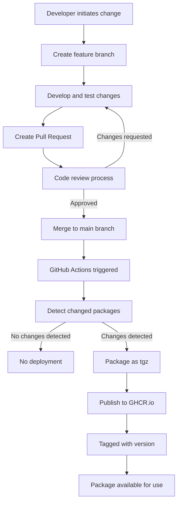
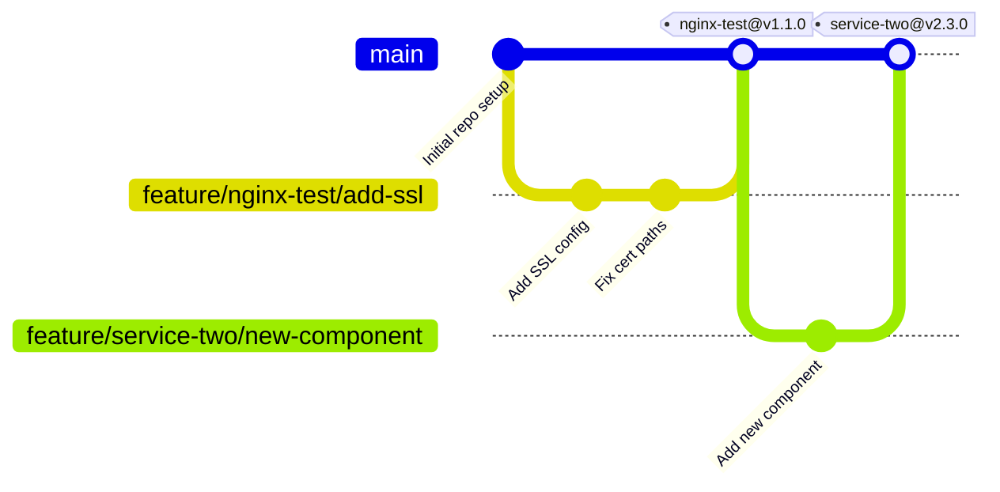
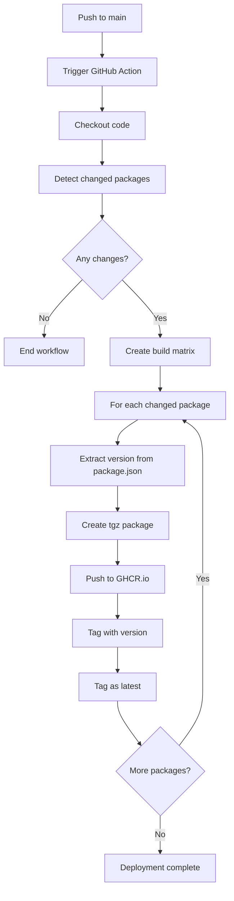

# Multi-Package OCI Repository Strategy

This document outlines our strategy for managing multiple Docker Compose configurations as independent OCI artifacts in a monorepo structure.

## Repository Structure

```
packages/
├── nginx-test/
│   ├── package.json      # Contains version & metadata
│   └── src/
│       └── docker-compose.yaml
├── service-two/
│   ├── package.json
│   └── src/
│       └── docker-compose.yaml
```

Each package directory contains:
- A `package.json` file with version and metadata
- A `src` directory with the Docker Compose configuration

## Package Change Lifecycle



## Branching Strategy

Our branching strategy follows these guidelines:

| Branch Type | Naming Convention | Purpose |
|------------|------------------|---------|
| Main | `main` | Stable code for all packages |
| Feature | `feature/package-name/feature-description` | Development work on specific packages |
| Release | `release/package-name/v1.2.0` | Optional for significant releases |

## Branching Strategy Visualization



## Tagging Strategy

We use package-prefixed semantic versioning tags:

- **Format**: `package-name@v1.0.0`
- **Example**: `nginx-test@v1.0.0`

This approach allows for independent versioning while maintaining repository context.

## Version Management

Each package maintains its own version in `package.json`:

```json
{
  "name": "nginx-test",
  "version": "1.0.0",
  "description": "NGINX deployment package"
}
```

## Release Strategy

### Automated Releases

- Changes to packages are automatically detected and published when merged to `main`
- Version numbers are controlled in each package's configuration file

### Manual Releases

- GitHub Releases can be created with tags following the package-specific format
- Manual releases can trigger the deployment workflow with a specific version

## GitHub Actions Workflow

Our CI/CD pipeline intelligently detects and builds only changed packages:

```yaml
name: Build and Publish Changed Packages

on:
  push:
    branches: [main]
    paths:
      - 'packages/**'
  workflow_dispatch:

jobs:
  detect-changes:
    runs-on: ubuntu-latest
    outputs:
      changed_packages: ${{ steps.filter.outputs.changes }}
    steps:
      - uses: actions/checkout@v3
        with:
          fetch-depth: 0
      
      - name: Detect changed packages
        id: filter
        run: |
          # Get all directories directly under packages/ that have changed
          CHANGED=$(git diff --name-only ${{ github.event.before }} ${{ github.sha }} | grep "^packages/" | cut -d/ -f2 | sort | uniq | jq -R . | jq -s .)
          echo "changes=${CHANGED}" >> $GITHUB_OUTPUT
          echo "Changed packages: ${CHANGED}"
  
  build-and-publish:
    needs: detect-changes
    if: ${{ needs.detect-changes.outputs.changed_packages != '[]' }}
    runs-on: ubuntu-latest
    strategy:
      matrix:
        package: ${{ fromJson(needs.detect-changes.outputs.changed_packages) }}
    
    steps:
      - uses: actions/checkout@v3
      
      - name: Log in to GitHub Container Registry
        uses: docker/login-action@v2
        with:
          registry: ghcr.io
          username: ${{ github.actor }}
          password: ${{ secrets.GITHUB_TOKEN }}
      
      - name: Get package version
        id: package-version
        run: |
          VERSION=$(jq -r .version packages/${{ matrix.package }}/package.json)
          echo "version=${VERSION}" >> $GITHUB_OUTPUT
      
      - name: Package docker-compose as tgz
        run: |
          cd packages/${{ matrix.package }}
          tar -czf ${{ matrix.package }}.tgz -C src .
      
      - name: Push to GitHub Container Registry
        uses: docker/build-push-action@v4
        with:
          context: packages/${{ matrix.package }}
          push: true
          tags: |
            ghcr.io/${{ github.repository_owner }}/${{ matrix.package }}:${{ steps.package-version.outputs.version }}
            ghcr.io/${{ github.repository_owner }}/${{ matrix.package }}:latest
```

## CI/CD Workflow Visualization



## Implementation Tips

### OCI Annotations

Include useful metadata in your OCI artifacts:

```yaml
annotations:
  org.opencontainers.image.source: "{{ github.repository }}"
  org.opencontainers.image.created: "{{ date }}"
  org.opencontainers.image.revision: "{{ github.sha }}"
```

### Version Management

- Consider using conventional commits to determine version increments
- Implement pre-commit hooks or automated PRs for version updates

### Documentation

- Maintain a `CHANGELOG.md` in each package directory
- Document package-specific requirements and dependencies

This approach provides independent package versioning while maintaining the benefits of a monorepo structure and minimizing unnecessary builds.
